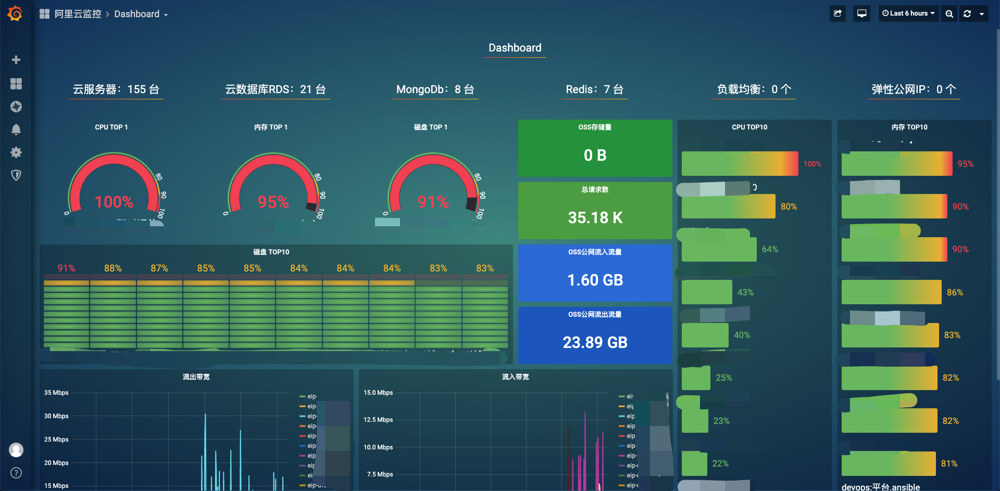
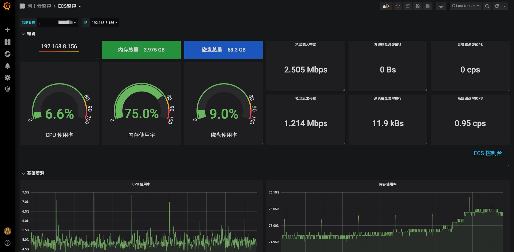
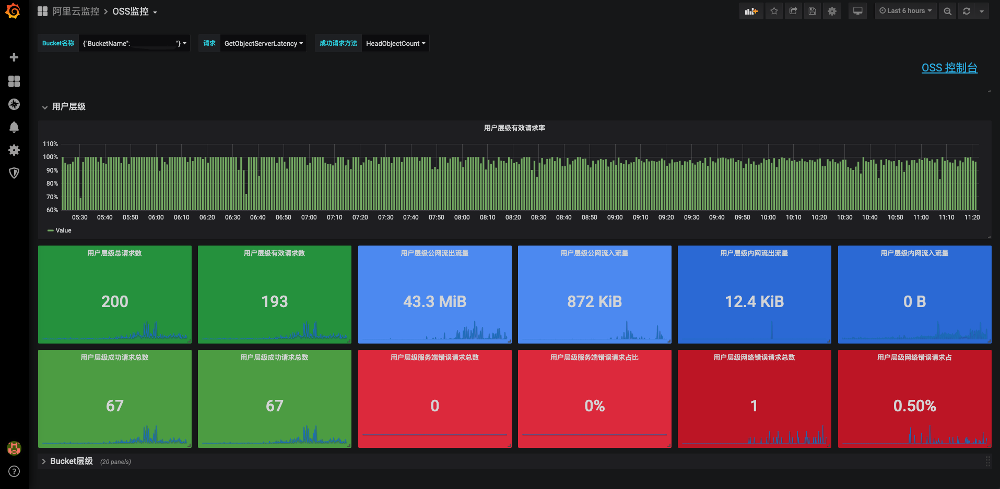
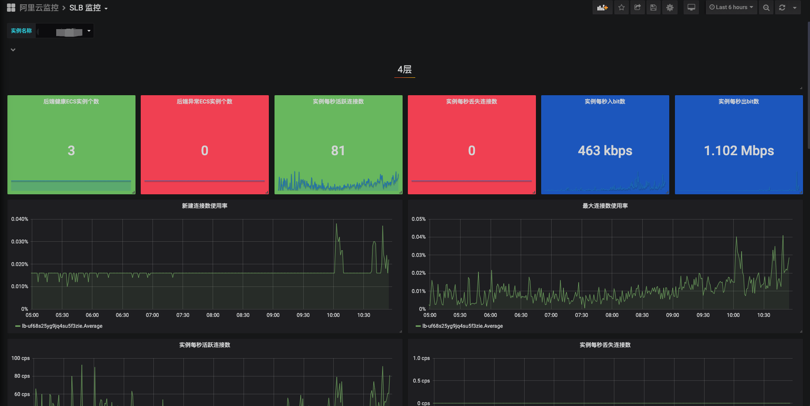
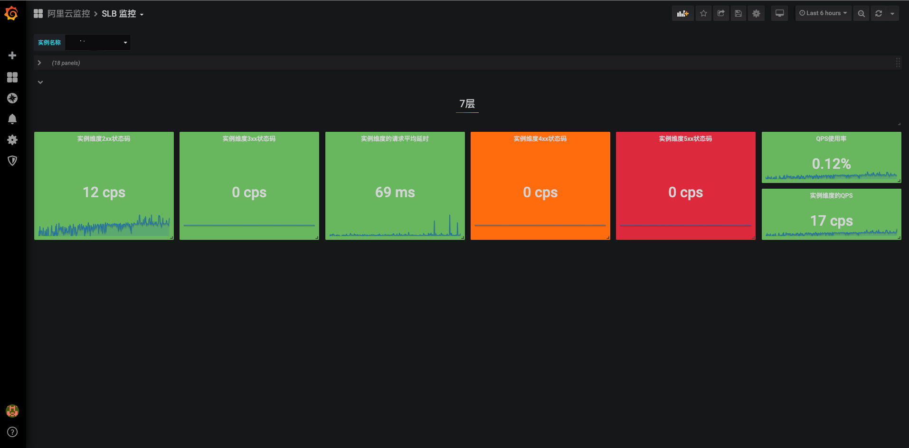
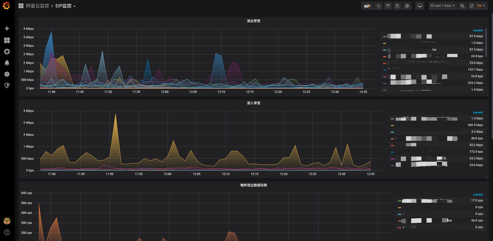
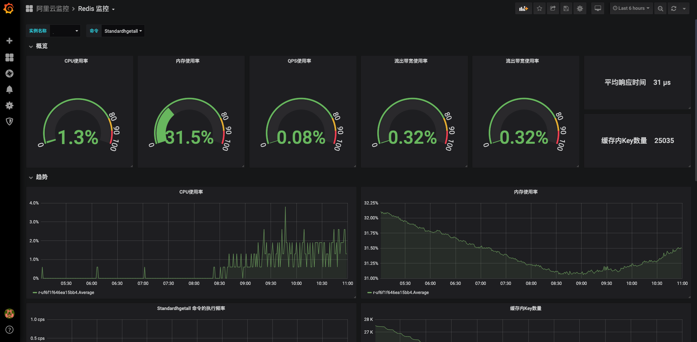

# cms-grafana-builder

[English](README.md) | 简体中文


基于开源的监控和可视化组件 grafana，展示阿里云监控数据。

## 介绍

运行部署 grafana 并展示一整套阿里云监控的仪表盘。

## 使用 Helm 安装

### Helm v3

在 [release](https://github.com/sunny0826/cms-grafana-builder/releases) 页面下载 cms-grafana-0.3.0.tgz 包。

使用 `my-release` 名称安装：

```bash
# start
$ helm install my-release kk-grafana-cms \
--namespace {your_namespace} \
--set access_key_id={your_access_key_id} \
--set access_secret={your_access_secret} \
--set region_id={your_aliyun_region_id} \
--set password={admin_password}

# 设置 ingress 和 SSL 证书 
helm install my-release kk-grafana-cms \
--namespace {your_namespace} \
--set access_key_id={your_access_key_id} \
--set access_secret={your_access_secret} \
--set region_id={your_aliyun_region_id} \
--set password={admin_password} \
--set ingress.enabled=true \
--set ingress.hosts[0].host="{your_host}",ingress.hosts[0].paths[0]="/"
--set ingress.tls[0].secretName="{your_tls_secret_name}",ingress.tls[0].hosts[0]="{your_tls_host}"
```
__请将 DNS 解析到该 ingress。__

## 卸载

```bash
$ helm uninstall my-release
```

## 配置

配置参数：

参数                       	 	| 说明                                				| 默认值
------------------------------- | ------------------------------------------------- | ----------------------------------------------------------
`plugins`           	        | Grafana 插件列表。          	            		| `farski-blendstat-panel,grafana-simple-json-datasource,https://github.com/sunny0826/aliyun-cms-grafana/archive/master.zip;aliyun-cms-grafana`
`access_key_id`                	| 阿里云 Access Key Id。                  			| ``
`access_secret`                	| 阿里云 Access Secret。                  			| ``
`region_id`                    	| 阿里云 Region Id。                       			| `cn-shanghai`
`password`                    	| Grafana admin 密码。                      			| `admin`
`schedule`                    	| 定时任务配置。                            			| `"30 2 * * *"`
`image.repository`           	| 镜像 repository 名称。         	            		| `grafana/grafana`
`image.pullPolicy`         		| 镜像拉取策略。                        				| `Always`
`build_image.repository`        | init 镜像。                                  	    | `guoxudongdocker/grafana-build`
`build_image.tag`              	| 镜像 tag。                       		  	    	| `0.2.1-release`
`build_image.pullPolicy`       	| 镜像拉取策略。                          				| `Always`
`backend_image.repository`      | 自定义数据源镜像。                                   | `guoxudongdocker/grafana-build`
`backend_image.tag`             | 镜像 tag。                       		  	    	| `0.2.1-release`
`backend_image.pullPolicy`      | 镜像拉取策略。                          				| `Always`
`ingress.enabled`         		| 是否开启 ingress.                   				| `false`
`ingress.hosts`          		| Ingress hosts.                       				| `[]`

## 截图

### Dashboard



### ECS


### RDS


### OSS


### SLB

**4层**



**7层**



### EIP


### Redis


